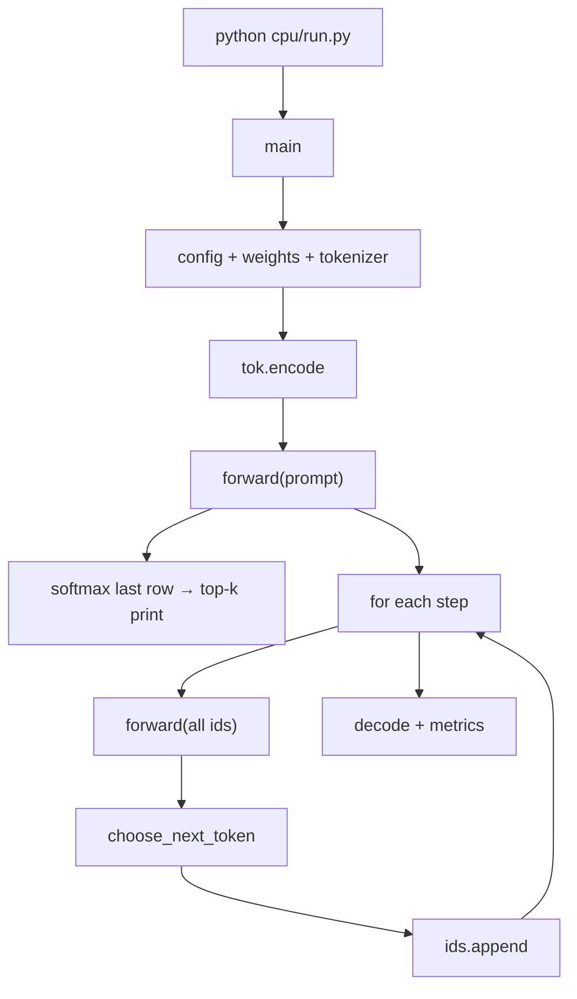

# CPU inference walkthrough (`cpu/run.py`)

Canonical **call stack** from one CLI command down to the equations in `cpu/gpt2.py`. Use this when reading code or mapping slides to function names.

For **live demo order and what to say**, see [`demo-narrative.md`](demo-narrative.md).

---

## Example command

From repo root (defaults: greedy, 20 new tokens, top-10 preview after prefill):

```bash
python cpu/run.py --prompt "The strangest thing I found inside my refrigerator was"
```

Python adds `cpu/` to `sys.path`, so `from gpt2 import ...` resolves to `cpu/gpt2.py`.

---

## Phase 0 — Interpreter entry

```text
python cpu/run.py
  → load cpu/run.py (imports gpt2, metrics, sampling, GPT2Tokenizer)
  → if __name__ == "__main__": main()
```

No model math yet — only module imports.

---

## Phase 1 — `main()` setup

| Order | Call | Role |
|------:|------|------|
| 1 | `parse_args()` | CLI → `model_dir`, `prompt`, `steps`, sampling flags |
| 2 | `SamplingConfig(...)` + `validate()` | Default `temperature=0` → greedy |
| 3 | `load_gpt2_config(model_dir)` | `GPT2Config.from_json` → read `models/gpt2/config.json` |
| 4 | `load_gpt2_weights(model_dir, cfg)` | Load tensors + `assert_gpt2_weight_layout` |
| 5 | `GPT2Tokenizer.from_pretrained(model_dir)` | Vocab / BPE |
| 6 | `tok.encode(prompt, add_special_tokens=False)` | Text → `input_ids: list[int]` |

**Nested: `load_gpt2_weights`**

```text
load_gpt2_weights
  └─ _load_state_dict
       └─ model.safetensors (or pytorch_model.bin) → float32 arrays
  └─ assemble GPT2Weights (wte, wpe, 12 layers)
  └─ assert_gpt2_weight_layout   # shapes only
```

---

## Phase 2 — Prefill (first full forward)

```text
arr = np.array(input_ids)
logits = forward(arr, cfg, weights)
```

**Stack:**

```text
forward
  └─ forward_hidden_states
       ├─ embeddings
       ├─ transformer_block × cfg.n_layer (12)
       └─ final layer norm + LM head
```

### Embeddings

```python
x = w.wte[token_ids] + w.wpe[pos]   # pos = 0..T-1
```

Per position \(i\): \(x_i = W_{\text{te}}[t_i] + W_{\text{pe}}[i]\). Shape `[T, 768]`.

### One `transformer_block` (pre-norm GPT-2)

```text
transformer_block
  ├─ layer_norm(x, ln_1)           # μ, σ² on last dim; scale/shift
  ├─ causal_self_attention(...)
  ├─ x = x + h                     # residual
  ├─ layer_norm(x, ln_2)
  ├─ linear → gelu_new → linear    # MLP
  └─ return x + h
```

**Nested: `causal_self_attention`**

```text
causal_self_attention
  ├─ linear(x, c_attn_w, c_attn_b)     # QKV: [T,768] @ [768,2304]
  ├─ split Q, K, V; reshape to [n_head, T, head_dim]
  ├─ scores = (Q @ K^T) / sqrt(head_dim)   # [12, T, T]
  ├─ causal mask (future → large negative)
  ├─ softmax(scores)
  ├─ out = weights @ V
  ├─ merge heads → [T, 768]
  └─ linear(out, c_proj_w, c_proj_b)
```

Paper form: \(\mathrm{softmax}(QK^\top/\sqrt{d_h} + M)\,V\), then output projection.

### Logits (tied LM head)

```text
x = layer_norm(x, ln_f_w, ln_f_b)
logits = x @ w.wte.T              # [T, 50257]
```

### Top-k table (display only)

```text
softmax(logits[-1])               # distribution at last prompt position
argsort → tok.decode              # top-N strings for the audience
```

Does not append a token yet.

---

## Phase 3 — Decode loop (default `--steps 20`)

```text
ids = list(input_ids)
for step in range(steps):
    logits = forward(np.array(ids), cfg, weights)   # full sequence every time
    next_id = choose_next_token(logits, ids, sampling, rng)
    ids.append(next_id)
```

**No KV cache:** step \(s\) runs attention over length \(T_0 + s\). Cost grows ~\(O(T^2)\) per layer per step.

### Greedy path (`temperature=0`, default)

```text
choose_next_token
  └─ prepare_logits_for_sampling → logits[-1] unchanged
  └─ greedy_token_id → argmax
```

Math: \(t_{\text{new}} = \arg\max_j \;\text{logits}_{T-1,j}\).

Stochastic mode (`temperature > 0`) runs repetition penalty, \( \text{logits}/T \), top-k, top-p, then `softmax` + `rng.choice` — same `forward`, different pick.

### Finish

```text
tok.decode(ids)
print_report(metrics, ...)
```

---

## How many forwards on the default command?

| Phase | Count | Sequence length |
|-------|------:|-----------------|
| Prefill | 1 | \(T_0\) (prompt) |
| Decode | 20 | \(T_0, T_0+1, \ldots, T_0+19\) |

**21 full GPT-2 forwards** per run.

---

## Flow diagram



---

## Slide extract (don’t paste the whole doc on slides)

Use **3–4 slides**; link or QR to this file for depth.

1. **CLI → tensors** — `encode` → `forward` → `logits [T, V]` → `argmax` on last row → repeat.
2. **Inside `forward`** — embed → 12× block → `ln_f` → `x @ wte.T`.
3. **One block** — pre-norm → MHA (\(QK^\top V\)) → residual → MLP (GELU) → residual; function names from `cpu/gpt2.py`.
4. **Systems** — 21 full forwards, no KV cache; `causal_self_attention` is \(O(T^2)\) per layer → GPU / cache motivation.

Equation → function → (future) kernel mapping matches [`3-day-plan.md`](3-day-plan.md) Day 3.
